# RE-AI
Use idapython create call topology, AI analysis function layer by layer. Get the target function conclusion.  

利用idapython创建函数调用拓扑，AI逐层分析函数，最终总结目标函数的功能。  

## Update
### 2025.4.18
1. Add function call_topology_print.  
2. Improved processing logic.  

### 2025.5.20
~~Happy 520~~  

+ Now, We can talk with LLM in IDA.  

## Theory
In low layer function call, there's no sub_call(unknown call), there just have system api, function with symbol and normal code.  

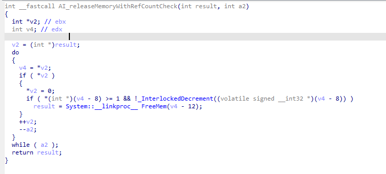  
  
Fix this low layer, the function unknown call will minus who call the low layer.  
Using comments to describe the function functionality and return it to high layer, that will get a higher analysis accuracy.  
In the end, high layer will become low layer. Round and round, target function will easy to read.   

## Config

You need fill the config in code, including API_KEY, API_URL and MODEL.   
You can choose chinese or english prompt to get descriptions in different languages.  

## Example
### Function deeping analyze
First right click on target pseudocode view, choose REAI:exception_code_check.  
I suggest clearing exception code in the call topology.  

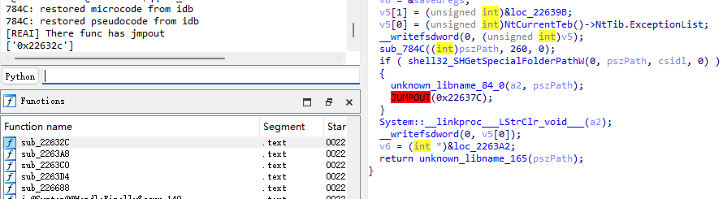  

Then, choose REAI:func_analyze, start AI analysis layer by layer.  
Each round wait time depend on the one, which is the longest waiting time in multithreading.   

AI WORK:  

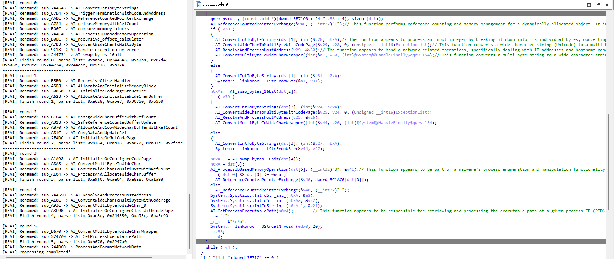  

Get call topology by choose REAI:call_topology_print.  

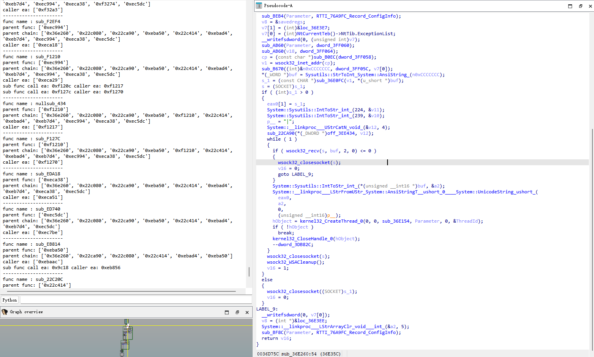  

For the target function, you should press F5 by hand to refresh new name.  

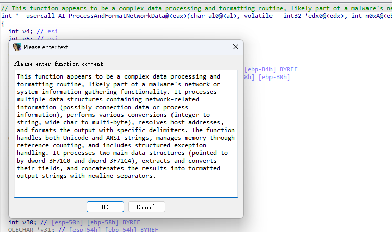  

### LLM conversation
You can use ida pseudocode talk with LLM.
First right click on target pseudocode view, choose REAI:conversation to get discussion function.  
Then choose REAI.

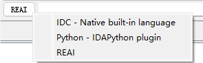

Now we can talk about the function.  

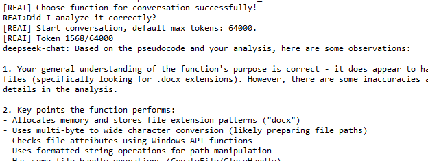

## Explain
### Orphan comments will appear here, why?

With the pseudocode modify and refresh, it will be happen, but don't worry, the functional description has marked source function. When the pseudocode is sent to AI, he will know the description source.  

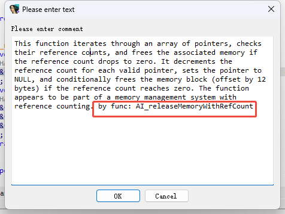

### Function name conflict

When the large model is not intelligent enough, function functions cannot be accurately described, resulting in function name conflicts.  

### Function handle
Infact, they all depend on create and decompile **ALL** function. So you can create and decompile **ALL** function once by choose anyone when you are debug shellcode. Due to decompile all function that you may have to resolve many unimportant function's decompile problem.  
Recommend REAI:exception_code_check, it's faster.  

### Decompile fail
Some time you may encounter decompile fail. Go to the address where decompilation failed.  

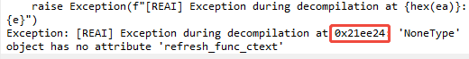

Press "F5" to get real failed address.

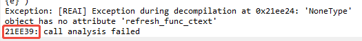

Go to the decompile fail function, press 'u' and 'p' to recreate the function.  

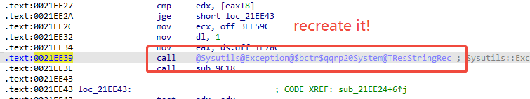  

## Support
The plugin suport 7.4 between 9.x.  
I use deepseek to analysis, so it's should support openai too.  
If you have any question, please open an issue on GitHub.  
The plugin now has been integrated into the SUKI_IDA project(https://github.com/miunasu/SUKI_IDA).  
